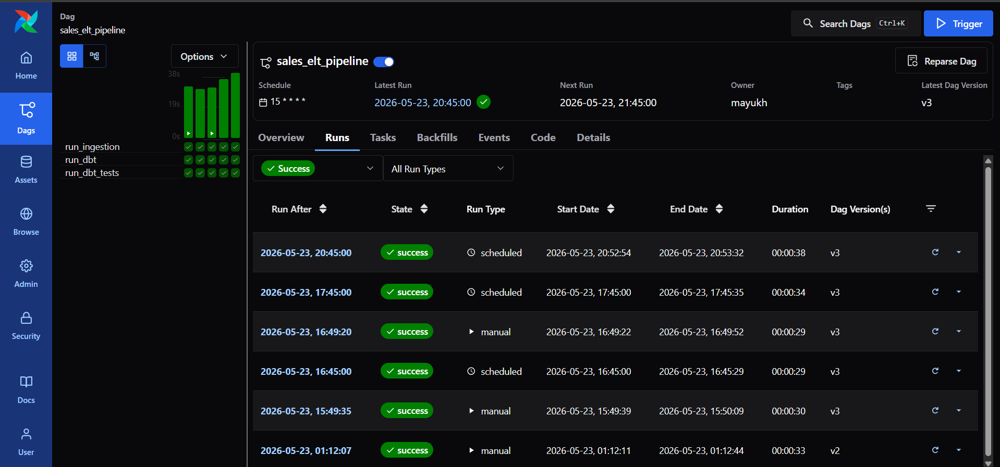
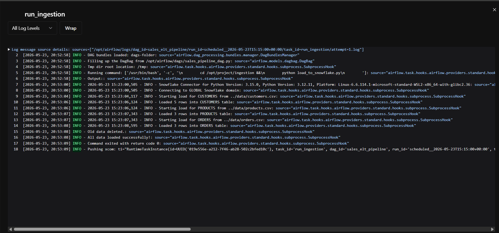
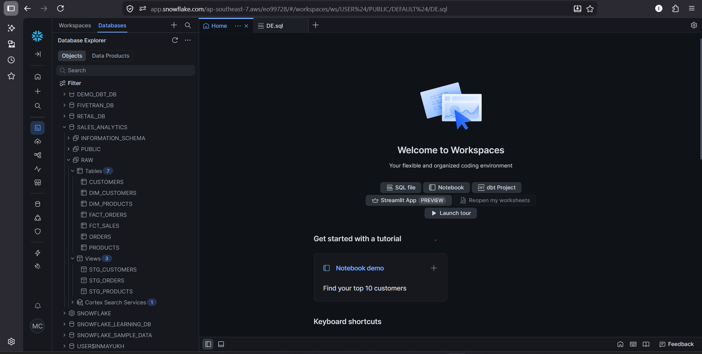

# Sales Analytics ELT Pipeline

## Project Overview

The pipeline ingests sales data from CSV files into Amazon S3, loads data into Snowflake using COPY INTO, performs transformations using dbt, validates data quality using dbt tests, and orchestrates the complete workflow using Airflow.

---

# Project Status

✅ Active  
✅ End-to-end pipeline operational  
✅ Cloud ingestion integrated using Amazon S3  

---

# Architecture

```text
CSV Files
    ↓
Amazon S3
    ↓
Snowflake COPY INTO
    ↓
Snowflake RAW Tables
    ↓
dbt Staging Models
    ↓
dbt Mart Models (Dimensions + Facts)
    ↓
dbt Tests & Freshness Checks
    ↓
Airflow Orchestration
```

---

# Architecture Diagram

Detailed architecture is available here:

[View Architecture Diagram](docs/architecture.md)

---

# Tech Stack

| Category | Technologies |
|---|---|
| Programming | Python, SQL |
| Cloud | AWS S3 |
| Data Warehouse | Snowflake |
| Transformation | dbt |
| Orchestration | Apache Airflow |
| Containerization | Docker |
| Version Control | Git, GitHub |
| Data Modeling | Star Schema, Fact & Dimension Tables |

---

# Project Features

## Data Ingestion

* Cloud-based ingestion using Amazon S3
* Snowflake bulk loading using COPY INTO
* Automated ingestion orchestration using Python
* CSV-based batch ingestion pipeline
* Logging and observability added

## Data Warehouse Modeling

* Staging layer
* Star schema design
* Dimension tables
* Fact tables

## dbt Transformations

* Modular SQL transformations
* Incremental model implementation
* Dependency management using ref()

## Data Quality Checks

Implemented:

* not_null
* unique
* relationships
* accepted_values
* custom business-rule tests

## Orchestration

* Automated DAG execution using Apache Airflow
* End-to-end orchestration for S3 ingestion, dbt run, and dbt tests
* Custom cron scheduling
* Dockerized Airflow deployment

## Security Improvements

* Environment variable-based credential management
* .env protection using .gitignore

---

# Project Structure

```text
Sales Analytics ELT Pipeline
│
├── airflow
│   ├── dags
│   ├── config
│   └── docker-compose.yaml
│
├── data
│   ├── customers.csv
│   ├── products.csv
│   └── orders.csv
│
├── dbt_project
│   ├── models
│   ├── tests
│   └── dbt_project.yml
│
├── ingestion
│   ├── load_to_snowflake.py
│   └── load_s3_to_snowflake.py
│
├── screenshots
├── docs
├── .env
├── .gitignore
└── README.md
```
---

# How To Run The Project

## Clone Repository

```bash
git clone https://github.com/inmayukh/sales-analytics-elt-pipeline.git
```

## Create Virtual Environment

```bash
python -m venv venv
```

## Activate Virtual Environment

### Windows

```bash
.\venv\Scripts\Activate.ps1
```

## Install Dependencies

```bash
pip install -r airflow/requirements.txt
```

## Start Airflow

```bash
docker compose up
```

## Run dbt

```bash
cd dbt_project

dbt run
dbt test
```

---

# Screenshots

## Airflow DAG



---

## Airflow Logs



---

## Snowflake Warehouse Tables



---

# Future Improvements

- Production-grade Snowflake storage integration using IAM roles
- CI/CD integration using GitHub Actions
- Automated alerting and notifications
- Real-time streaming ingestion
- Advanced dbt snapshots and macros
- Infrastructure as Code (Terraform)

---

# Key Learning Outcomes

* ELT pipeline design
* Data warehouse modeling
* dbt transformations and testing
* Workflow orchestration
* Incremental data processing
* Data observability
* Secure configuration management

---

# Author

Mayukh Chowdhury
