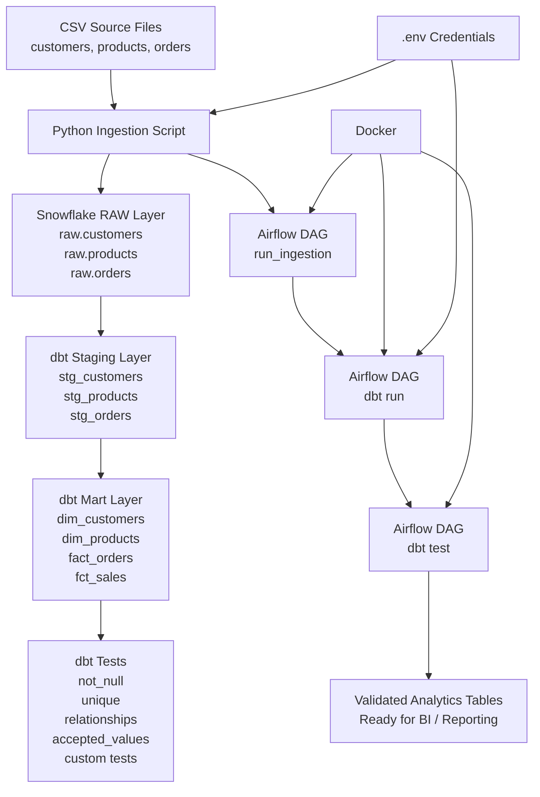

# Sales Analytics ELT Pipeline Architecture

```mermaid
flowchart TD

    A[CSV Source Files<br/>customers, products, orders] --> B[Python Ingestion Script]

    B --> C[Snowflake RAW Layer<br/>raw.customers<br/>raw.products<br/>raw.orders]

    C --> D[dbt Staging Layer<br/>stg_customers<br/>stg_products<br/>stg_orders]

    D --> E[dbt Mart Layer<br/>dim_customers<br/>dim_products<br/>fact_orders<br/>fct_sales]

    E --> F[dbt Tests<br/>not_null<br/>unique<br/>relationships<br/>accepted_values<br/>custom tests]

    B --> G[Airflow DAG<br/>run_ingestion]

    G --> H[Airflow DAG<br/>dbt run]

    H --> I[Airflow DAG<br/>dbt test]

    I --> J[Validated Analytics Tables<br/>Ready for BI / Reporting]

    K[Docker] --> G
    K --> H
    K --> I

    L[.env Credentials] --> B
    L --> H
```